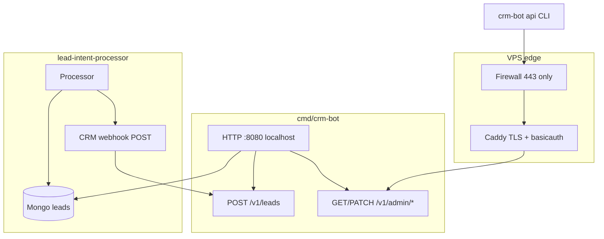

# Backlog: CRM sidecar (`cmd/crm-bot`)

Sidecar `cmd/crm-bot` + `internal/crm/*`. Parser hot path is not touched. Operators use **CLI** (`crm-bot api` / `crm-bot db`). No Telegram, no web UI.

Integration: parser POSTs leads to `/v1/leads`; sales uses CLI against VPS (Caddy basicauth + `/v1/admin/*`).

---

## Architecture



**Security model**

| Layer | Role |
| --- | --- |
| Firewall | Allow 22/443; deny public 8080, 27017 |
| Caddy | TLS + basicauth for `/v1/admin/*` |
| CRM HTTP | Bearer on `/v1/leads` only (`CRM_WEBHOOK_SECRET`) |
| CLI | `CRM_API_URL` + `CRM_API_USER` + `CRM_API_PASSWORD` |

**Out of scope:** Telegram Bot API, web UI, Gemini from CRM, lead upsert from CRM.

---

## Package layout

```
cmd/crm-bot/
  main.go, root.go, config.go, db.go, api.go, version.go
internal/crm/
  config/
  app/
  store/
  admin/           # HTTP /v1/admin/*
  apiclient/       # remote CLI HTTP client
  webhook/
  metrics/
config/caddy/
  Caddyfile.example
  Caddyfile.dev
```

---

## Environment variables

### Server (`crm-bot run`)

| Var | Default | Notes |
| --- | --- | --- |
| `MONGO_URI` | - | Required |
| `CRM_WEBHOOK_ADDR` | `127.0.0.1:8080` | Bind localhost in prod |
| `CRM_WEBHOOK_SECRET` | - | Bearer for parser POST `/v1/leads` |
| `CRM_*` timeouts | see `.env.example` | Mongo query/write |

### Remote CLI (`crm-bot api`)

| Var | Notes |
| --- | --- |
| `CRM_API_URL` | `https://crm.example.com` or `http://127.0.0.1:8080` |
| `CRM_API_USER` | Caddy basicauth user |
| `CRM_API_PASSWORD` | Caddy basicauth password |
| `CRM_API_TIMEOUT` | Default `15s` |

### Parser

| Var | Notes |
| --- | --- |
| `PARSER_CRM_WEBHOOK=true` | |
| `PARSER_CRM_WEBHOOK_URL` | `http://crm-bot:8080/v1/leads` in compose |
| `PARSER_CRM_WEBHOOK_SECRET` | Same as `CRM_WEBHOOK_SECRET` |
| `PARSER_LEAD_STATUS_ENABLED=true` | Required for `status: new` |

---

## CLI surface

### Remote (`crm-bot api`)

```bash
crm-bot api stats
crm-bot api list --status new --limit 20
crm-bot api search --q voluum
crm-bot api show --hash <id>
crm-bot api set-status --hash <id> --status contacted
crm-bot api delete --hash <id> --yes
crm-bot api purge --status spam --yes
```

### On-server Mongo (`crm-bot db`)

```bash
crm-bot db stats
crm-bot db set-status --hash <id> --status spam
crm-bot db purge --all --yes
```

---

## HTTP surface (server)

| Method | Path | Auth |
| --- | --- | --- |
| POST | `/v1/leads` | Bearer `CRM_WEBHOOK_SECRET` |
| GET/PATCH/DELETE | `/v1/admin/*` | Caddy basicauth |

---

## Phases

| ID | Task | Status |
| --- | --- | --- |
| CRM-01 | HTTP server, webhook, shutdown | done |
| CRM-02 | Mongo store + admin HTTP API | done |
| CRM-03 | `crm-bot db` on-server CLI | done |
| CRM-04 | `crm-bot api` remote CLI | done |
| CRM-05 | Caddy edge + firewall docs | done |
| CRM-06 | Remove Telegram + web UI | done |
| CRM-07 | Notes/tags via API (optional) | backlog |
| CRM-08 | Audit log collection | backlog |

---

## Verification

```bash
go build ./cmd/crm-bot/...
go test ./internal/crm/...
make build-crm-bot
bash scripts/dev/crm_bot_smoke.sh
CRM_API_URL=http://127.0.0.1:8080 ./bin/crm-bot api stats
```

Prod: `CRM_API_URL=https://crm.example.com crm-bot api list --status new`
