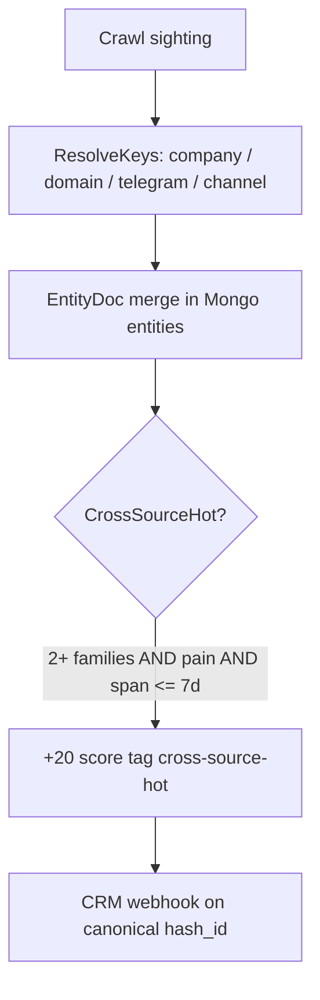
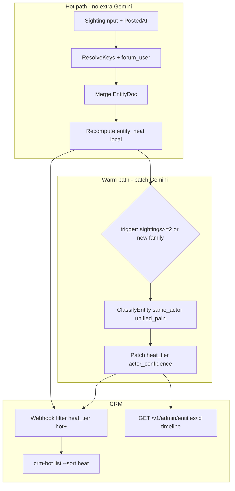

# Backlog: Entity graph, recency heat, and cross-source buyer intent

Buyers with tracker pain rarely post once. They search AffiliateFix, BHW, Reddit, Telegram, and tgweb landers over days or weeks. **High ROI for ad-event-processor sales:** link partial signals into one entity, rank by recency-weighted pain, validate with Gemini on the **entity** (not single snippet), surface **blazing/hot** leads in CRM inbox first.

**Related code:** `internal/entity/`, `internal/gemini/cluster.go`, `internal/pipeline/processor.go`, `internal/sink/entity_store.go`, `internal/crm/store/`, `cmd/crm-bot/`.

**See also:** [backlog-crm-bot.md](backlog-crm-bot.md), [backlog-geo-compliance.md](backlog-geo-compliance.md), [ops.md](ops.md) (discover loop).

---

## Why this backlog (ROI)

| Without entity heat | With entity heat |
| --- | --- |
| Same buyer = 3 unrelated `hash_id` rows | One `entity_id`, timeline of pains |
| Month-old AF post discarded by 7d span rule | Stale sighting = context; fresh sighting = trigger |
| Outreach on weakest single post | Outreach cites **fresh pain + history** |
| Forum-only identity invisible | Forum user + email + TG merge when possible |
| CRM sorted by score of one crawl | CRM sorted by **entity_heat** |

Expected sales impact: higher reply rate on pain-base outbound (buyer sees you read multiple threads), fewer false negatives (good leads split across sources), fewer false positives (one noisy post without corroboration stays warm/cold).

---

## Current behavior (v0)



| Component | Location | Limit |
| --- | --- | --- |
| Identity keys | `internal/entity/resolver.go` | No forum username |
| Sighting time | `entitySightingInput` | Uses `SeenAt=now`, not `PostedAt` |
| Hot rule | `internal/entity/cross_source.go` | Boolean; **span** <= 7d, not per-post recency |
| Semantic link | `internal/gemini/cluster.go` | Near-duplicate **text** only (cosine >= 0.92) |
| Gemini buyer | `internal/gemini/icp.go` | Per-lead snippet, not same-actor across sources |
| CRM | `entity_id` on lead card | No entity timeline API |

---

## Three problems (negative impact on selection)

These gaps **under-select** real buyers and **over-select** noise if ignored.

### Problem 1 - Forum identity missing (under-merge)

**Symptom:** Same person posts on AffiliateFix and BHW under the same username but without shared email/TG in text. Parser creates **two entities**, CRM shows two medium leads.

**Risk:** Miss cross-source hot buyer; duplicate outreach to same person later (bad UX).

**Fix track:** HEAT-P1 (forum user keys) + HEAT-P3 (Gemini same-actor).

### Problem 2 - Wrong time model (under-hot and over-cold)

**Symptom:** Post A (35d ago) + post B (5d ago) on different forums = span 35d > 7d => **not** `cross-source-hot`, though B is a strong fresh trigger.

**Symptom:** Crawl `SeenAt` masks true forum `PostedAt`; recency skew on re-crawls.

**Risk:** Fresh pain buried; stale-only entities ranked too high when re-indexed.

**Fix track:** HEAT-P0 (PostedAt in sightings) + HEAT-P2 (heat score decay).

### Problem 3 - No entity-level semantics (false merge / false split)

**False split:** Same company, two buyers complain (ops vs founder) - shared domain merges one entity.

**False merge:** Embedding similarity on generic phrases ("voluum alternative") links unrelated people.

**Risk:** Wrong outreach angle; wasted pilot on non-decision-maker.

**Fix track:** HEAT-P3 (Gemini `ClassifyEntity`) + HEAT-P4 (confidence gates on CRM webhook).

---

## Target architecture



### Heat tiers (product)

| Tier | Intended rule (configurable) | Sales action |
| --- | --- | --- |
| `blazing` | heat >= 80, fresh sighting <= 7d, families >= 2, actor_conf >= 0.75 | Same-day reply, pilot offer |
| `hot` | heat >= 50, fresh sighting <= 14d | Top of inbox |
| `warm` | heat >= 25 | Watch / slow nurture |
| `cold` | else | Do not webhook; keep in Mongo for graph |

Legacy tag `cross-source-hot` remains during migration; map to `hot` when heat_score present.

### Heat score (local, deterministic)

```
sighting_weight(i) = pain_weight(i) * recency_decay(age_i)

recency_decay(age):
  age <= 7d   -> 1.0
  age <= 30d  -> 0.6
  age <= 90d  -> 0.25
  age > 90d   -> 0.1

pain_weight from keyword score bucket + matched pain tags (cap per sighting)

entity_heat = sum(sighting_weight last 20) * diversity_bonus

diversity_bonus:
  distinct families with pain in last 30d >= 3 -> 1.5
  >= 2 -> 1.3
  else -> 1.0
```

`age_i = now - posted_at` (UTC). If `posted_at` zero, fall back to `seen_at` with decay 0.5 max (unknown date penalty).

---

## Phase summary

| Phase | Goal | Type | Est. |
| --- | --- | --- | --- |
| **P0** | Correct timestamps + sighting subdocs | Go + Mongo | 1 d | **done** |
| **P1** | Forum identity keys | Go + forum sources | 1 d |
| **P2** | Entity heat score + tiers (local) | Go + tests | 1-2 d |
| **P3** | Gemini entity validation (warm) | Go + gemini | 2 d |
| **P4** | CRM entity inbox + webhook gates | Go + crm-bot | 1-2 d |
| **P5** | Ops tuning + false-positive guards | data + scripts | 1 d |

Ship P0-P2 before changing CRM webhook defaults. P3-P4 before prod `heat_tier` gate.

---

## P0 - PostedAt and sighting subdocuments

**Status:** done (HEAT-P0-01, HEAT-P0-02).

### HEAT-P0-01 - Use PostedAt in entity sightings

| Field | Detail |
| --- | --- |
| **Problem** | `entitySightingInput` sets `SeenAt: time.Now()`; forum `PostedAt` ignored for entity timeline. |
| **Outcome** | Each merge stores accurate post time for recency. |

**Implementation**

1. `entity.SightingInput`: add `PostedAt time.Time` (optional).
2. `entitySightingInput` in `processor.go`: set `PostedAt: task.Item.PostedAt`, `SeenAt: time.Now().UTC()`.
3. `sightingTime()` in `merge.go`: prefer `PostedAt` when non-zero for `FirstSeen`/`LastSeen` on entity; always store both on subdoc.
4. Ensure forum/warrior/reddit sources populate `RawItem.PostedAt` (forum parse already has `PostedAt` on posts - wire emit path if missing).

**Files**

| File | Change |
| --- | --- |
| `internal/entity/doc.go` | `EntitySighting` struct |
| `internal/entity/merge.go` | append sighting subdoc, cap 20 FIFO |
| `internal/pipeline/processor.go` | pass PostedAt |
| `internal/sources/forum/*` | verify PostedAt on emitted items |

**Verification**

```bash
go test ./internal/entity/... -run Sighting -v
go test ./internal/pipeline/... -run Entity -v
```

**Acceptance**

- Entity with forum post dated 30d ago has `first_seen` ~= posted date, not crawl date.
- Re-crawl same URL does not add duplicate sighting (same hash_id dedup still applies).

---

### HEAT-P0-02 - Mongo schema for sightings array

| Field | Detail |
| --- | --- |
| **Problem** | EntityDoc only aggregates counters; no per-sighting audit for sales or Gemini batch. |
| **Outcome** | `sightings[]` on entity document with hash_id, source, family, posted_at, matched, snippet_trunc, score. |

**Implementation**

1. Extend `EntityDoc` BSON tags; migration tolerant (empty array on old docs).
2. `MergeSighting` / atomic backend: push sighting, trim to last 20 by `posted_at desc`.
3. Index: `{ heat_score: -1, last_seen: -1 }` for CRM list (P4).

**Verification**

```bash
go test ./internal/sink/... -run Entity -v
```

---

## P1 - Forum identity (Problem 1) - DONE

### HEAT-P1-01 - Forum user entity keys

| Field | Detail |
| --- | --- |
| **Problem** | `ResolveKeys` has no forum username; cross-forum same nick not linked. |
| **Outcome** | Stable key `forum_user:{host}:{username}` merged with email/TG/domain aliases. |

**Implementation**

1. Add `KindForumUser = "forum_user"` in `internal/entity/key.go` (priority after domain, before telegram channel).
2. `NormalizeForumUser(host, user)` - lower case, trim, strip HTML entities.
3. Populate from:
   - `RawItem.Username` when source family is `forum`, `warrior`, `affiliatefix` (prefix rules in `SourceFamily` or dedicated helper).
   - Optional: XenForo `data-user-id` attribute as `forum_uid:{host}:{id}` secondary alias (stronger than display name changes).
4. Pass `DisplayName` / forum author into `ResolveInputFromLead` when username empty.

**False merge guard (same track)**

- Do **not** merge on `forum_user` alone across hosts (BuyerJohn on AF != BuyerJohn on BHW).
- Merge when **two or more** independent keys intersect (e.g. same `telegram` + different forum users => still one entity; same forum_user + same host only adds one family).

**Files**

| File | Change |
| --- | --- |
| `internal/entity/resolver.go` | extract forum keys from source label + username |
| `internal/entity/resolver_test.go` | AF + BHW different hosts same TG email |
| `internal/sources/forum/parse.go` | expose host in source id if not already |

**Verification**

```bash
go test ./internal/entity/... -run Resolve -v
```

**Acceptance**

- Two posts, same `@buyer` email, AF + reddit => one entity, `source_count >= 2`.
- Same username, different hosts, no shared keys => **two** entities (until P3 Gemini links).

---

### HEAT-P1-02 - Source label normalization for graph - DONE

| Field | Detail |
| --- | --- |
| **Problem** | Inconsistent source strings break family counting. |
| **Outcome** | Documented map: `forum:affiliatefix`, `forum:blackhatworld`, `warrior:`, `reddit:`. |

**Implementation**

1. Table in this doc + comment in `SourceFamily()`.
2. Seed URLs in `data/seeds/forum_threads*.csv` use consistent host token.

**Source label map (HEAT-P1-02)**

| Crawler | Source label pattern | `SourceFamily` | Forum host key |
| --- | --- | --- | --- |
| forum | `forum:{host}/{thread-slug}` | `forum` | host from URL (e.g. `affiliatefix.com`) |
| warrior | `warrior:{thread-slug}` | `warrior` | `warriorforum` |
| reddit | `reddit:{subreddit}` | `reddit` | (no forum_user keys) |

Seeds use full HTTPS URLs; `sourceName()` derives host from thread URL.

---

## P2 - Entity heat score (Problem 2) - DONE

### HEAT-P2-01 - Implement `ComputeEntityHeat`

| Field | Detail |
| --- | --- |
| **Problem** | Boolean `CrossSourceHot` ignores per-sighting recency and stale+fresh pattern. |
| **Outcome** | `entity_heat` float + `heat_tier` enum on every merge. |

**Implementation**

1. New file `internal/entity/heat.go`: decay table, diversity bonus, tier thresholds (env overrides).
2. Call at end of `MergeSighting` and atomic merge path.
3. Store on `EntityDoc`: `heat_score`, `heat_tier`, `last_heat_at`, `fresh_sighting_at` (max posted_at in 14d).
4. Promote canonical `hash_id` to sighting with highest `sighting_weight` in last 14d (replace buyer-role-only rule over time).

**Config (`.env.example`)**

```env
PARSER_ENTITY_HEAT_ENABLED=true
PARSER_ENTITY_HEAT_BLAZING=80
PARSER_ENTITY_HEAT_HOT=50
PARSER_ENTITY_HEAT_WARM=25
PARSER_ENTITY_HEAT_DECAY_7D=1.0
PARSER_ENTITY_HEAT_DECAY_30D=0.6
PARSER_ENTITY_HEAT_DECAY_90D=0.25
```

**Verification**

```bash
go test ./internal/entity/... -run Heat -v
```

**Acceptance**

- Fixture: sighting 35d + 5d, two families, pain => tier `hot` or `blazing`, not `cold`.
- Fixture: single 60d sighting, one family => `warm` or `cold`, not webhook-eligible.

---

### HEAT-P2-02 - Patch lead from entity heat

| Field | Detail |
| --- | --- |
| **Problem** | CRM sees per-hash score; entity heat lives only on `entities` collection. |
| **Outcome** | On heat recompute, patch canonical lead: `entity_heat`, `heat_tier`, tags, optional score bump. |

**Implementation**

1. Extend `sink.LeadDoc` / webhook payload with `entity_heat`, `heat_tier`, `entity_sighting_count`.
2. `Processor` after merge: if tier >= hot, apply boost similar to `ApplyCrossSourceHotBoost` but use heat tiers (configurable boost table).
3. Deprecate hard 7d window: keep `CrossSourceHot()` as alias `heat_tier >= hot` for logs/tests during migration.

**Verification**

```bash
go test ./internal/pipeline/... -run CrossSource -v
go test ./internal/app/... -run webhook -v
```

---

## P3 - Gemini entity validation (Problem 3) - DONE

### HEAT-P3-01 - `ClassifyEntity` batch API

| Field | Detail |
| --- | --- |
| **Problem** | Per-snippet ICP misses cross-post narrative; embedding dup misses paraphrase and over-merges generic text. |
| **Outcome** | Warm-path job scores entity-level same-actor and unified pain. |

**Implementation**

1. New `internal/gemini/entity.go`:
   - Input: up to 5 sightings (snippet, source, posted_at, matched, contacts summary).
   - Output schema: `same_actor` bool, `actor_confidence` 0-1, `unified_pain` string, `buyer_intent` enum (hot/warm/cold/none), `split_recommended` bool, `why` string.
2. System prompt: decision-maker vs support noise; do not merge CPA/tax contexts; affiliate tracker pain only.
3. Trigger in `internal/warmpath/` or `coldpath`:
   - `entity.sighting_count >= 2` OR new source family OR `heat_score` crossed into hot band.
   - Debounce: max 1 Gemini entity call per `entity_id` per 6h unless new fresh sighting.
4. On `split_recommended`: flag entity `needs_review`, do not auto-merge future keys until ops resolves (optional P5).

**False merge mitigation**

- If `same_actor=false` and `actor_confidence >= 0.7`: split entity graph (P5) or downgrade tier to warm.
- If shared domain but roles conflict (support@ vs founder@), prompt must return split.

**Verification**

```bash
go test ./internal/gemini/... -run Entity -v
go test ./internal/warmpath/... -v
```

**Acceptance**

- Mock: two snippets same TG, different pains => same_actor true, unified_pain combines.
- Mock: same domain, "our affiliate program recruits" vs "voluum bill too high" => split or cold intent.

---

### HEAT-P3-02 - Link LeadCluster to entity (optional)

| Field | Detail |
| --- | --- |
| **Problem** | Semantic dup skips lead write but entity sighting may lack narrative link. |
| **Outcome** | Store `semantic_cluster_of` on sighting subdoc when `LeadCluster` matches. |

Low priority; ship after P3-01.

---

## P4 - CRM and webhook (sales ROI) - DONE

### HEAT-P4-01 - Entity admin API

| Field | Detail |
| --- | --- |
| **Outcome** | Ops sees graph before outreach. |

**Endpoints**

| Method | Path | Auth |
| --- | --- | --- |
| GET | `/v1/admin/entities/list?min_tier=hot&limit=50` | basicauth |
| GET | `/v1/admin/entities/get?entity_id=` | basicauth |
| GET | `/v1/admin/entities/leads?entity_id=` | basicauth (all hash_ids) |

**CLI**

```bash
crm-bot api entities list --min-tier hot --limit 20
crm-bot api entities get --id <entity_id>
```

**Response fields:** sightings timeline, heat_score, heat_tier, unified_pain, actor_confidence, source_families, canonical hash_id.

See [backlog-crm-bot.md](backlog-crm-bot.md) CRM-10.

---

### HEAT-P4-02 - Webhook gate on heat_tier

| Field | Detail |
| --- | --- |
| **Problem** | CRM flooded with single stale posts. |
| **Outcome** | When `PARSER_CRM_WEBHOOK_HEAT_MIN=hot`, webhook only if `heat_tier >= hot` AND existing geo/ICP/defer gates pass. |

**Implementation**

1. `internal/config/compliance_defaults.go`: if CRM webhook on, default `PARSER_CRM_WEBHOOK_HEAT_MIN=warm` (staging) / `hot` (prod doc).
2. Warm path patches tier before deferred webhook fires.
3. Document override for debugging (`min=cold`).

**Verification**

```bash
go test ./internal/app/deps_webhook_test.go -v
make crm-bot-smoke
```

---

### HEAT-P4-03 - Inbox sort by entity heat

| Field | Detail |
| --- | --- |
| **Outcome** | `crm-bot api list --status new` default sort: `entity_heat desc`, then `score desc`. |

Optional flag `--sort score` for legacy behavior.

---

## P5 - Guards and ops tuning

**Status: DONE** (2026-03-21)

### HEAT-P5-01 - Negative selection dashboard

| Field | Detail |
| --- | --- |
| **Outcome** | Weekly script catches under-merge / over-merge. |

**Metrics (`scripts/dev/entity_heat_report.sh`)**

- entities with `heat_tier=hot` but `actor_confidence < 0.5`
- entities with 3+ families but tier cold (under-hot regression)
- top `unified_pain` strings for keyword feedback
- merge rate: forum_user key hit rate

Pipe into `data/suggestions/` like discover diff ([ops.md](ops.md)).

---

### HEAT-P5-02 - Keyword feedback from unified_pain

| Field | Detail |
| --- | --- |
| **Outcome** | Gemini `unified_pain` -> manual review -> `keywords.json` / `discover.icp.json`. |

Closes loop with ad-event-processor pain vocabulary.

---

### HEAT-P5-03 - Manual entity split CLI

| Field | Detail |
| --- | --- |
| **Problem** | False merge from shared domain. |
| **Outcome** | `crm-bot db entity-split --id X --hash Y` moves hash to new entity (ops only). |

---

## Rollout order

```text
1. HEAT-P0 (timestamps + sightings[])
2. HEAT-P1 (forum keys)
3. HEAT-P2 (local heat + lead patch)
4. Soak 1 week: entity_heat_report, no webhook gate change
5. HEAT-P3 (Gemini entity)
6. HEAT-P4 (CRM API + webhook min tier hot)
7. HEAT-P5 (split tool + tuning)
```

---

## Risk matrix (selection quality)

| Risk | Phase | Mitigation |
| --- | --- | --- |
| Under-merge cross-forum | P1, P3 | forum_user host-scoped + Gemini same_actor |
| Over-merge shared domain | P3, P5 | split_recommended + manual split |
| Stale post triggers webhook | P2, P4 | recency decay + `fresh_sighting_at` gate |
| Generic keyword collision | P3 | entity prompt ignores review/comparison threads |
| Gemini cost spike | P3 | debounce 6h / entity; batch size cap 5 sightings |
| CRM inbox empty after gate | P4 | start `min_tier=warm`, tighten to hot after soak |

---

## Verification (full gate)

```bash
go test ./internal/entity/... ./internal/gemini/... ./internal/pipeline/... ./internal/warmpath/... ./internal/crm/... -count=1
go build ./...
make crm-bot-smoke
bash scripts/dev/entity_heat_report.sh   # after P5-01 added
```

Manual soak:

1. Run parser on `data/seeds/forum_threads.live.csv` fixtures + tgweb discover.
2. Confirm Mongo `entities` shows multi-sighting timeline for shared email fixture.
3. `crm-bot api entities list --min-tier hot` returns ranked rows.
4. Deferred webhook count drops for single stale posts; rises for fresh cross-source fixture.

---

## Cross-links

| Doc | Link |
| --- | --- |
| CRM tasks | [backlog-crm-bot.md](backlog-crm-bot.md) CRM-10 |
| Geo before CRM | [backlog-geo-compliance.md](backlog-geo-compliance.md) P0 |
| Prod env | [credentials.md](credentials.md) |
| Discover intake | [ops.md](ops.md), `config/discover.icp.json` |
