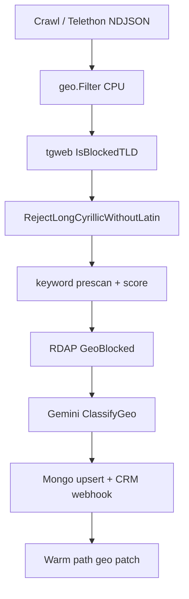

# Backlog: RU/BY geo compliance and global discovery bias

Hard-reject policy: `GEO_BLOCK_COUNTRIES=RU,BY` (see [README.md](../README.md)). This backlog closes gaps where RU operators slip through (EN text, `.com`, `telegram:@only`) and shifts discovery toward EU/LATAM/global buyers **without** a full pipeline rewrite.

**Related code:** `internal/geo/`, `internal/pipeline/processor.go`, `internal/gemini/geo.go`, `internal/warmpath/`, `sources/telegram/`, `config/discover.icp.json`.

---

## Current pipeline (geo touchpoints)



| Layer | Default | Blocks hidden RU? |
| --- | --- | --- |
| CPU `geo.Filter` | ON | Partial (explicit signals only) |
| Gemini inline geo | OFF | Yes, when enabled + sync |
| Gemini defer geo | ON if key+Mongo | After accept (CRM leak) |
| RDAP | ON | Only when email domain exists |
| Telegram channel about | Not used | No |

---

## Phase summary

| Phase | Goal | Type | Est. |
| --- | --- | --- | --- |
| **P0** | Block RU/BY before Mongo/CRM | config + data | 1-2 h |
| **P1** | Tighten heuristics and discovery intake | data + ops | 2-4 h |
| **P2** | Close code gaps on hot path | Go + Python | 1-2 d |
| **P3** | Boost non-RU global recall | config + data + small code | 2-3 d |
| **P4** | Structural compliance (optional) | Go + CRM | 3-5 d |

---

## P0 - Block before Mongo / CRM

Must ship first. No parser logic changes required except optional CRM filter.

### GEO-P0-01 - Prod env profile: sync Gemini geo

| Field | Detail |
| --- | --- |
| **Problem** | `PARSER_GEO_CLASSIFY=false` and `PARSER_GEMINI_SYNC_GEO=false` by default. With `PARSER_GEMINI_DEFER=true`, leads are accepted and CRM webhook fires before warm-path geo. |
| **Outcome** | Gemini geo runs on hot path before `Store.Upsert` for priority >= Medium. |

**Implementation**

1. Set in `.env` (and document in `config/env/.env.prod.example` if added):

```env
GEMINI_API_KEY=<from AI Studio>
PARSER_GEO_CLASSIFY=true
PARSER_GEMINI_SYNC_GEO=true
GEO_BLOCK_COUNTRIES=RU,BY
PARSER_ENRICH_RDAP=true
```

2. Alternative (higher Gemini RPM): `PARSER_GEMINI_DEFER=false` - all inline classify; drop warm-path geo batch for accept gate.

3. Update `docs/credentials.md` - add "prod compliance" subsection with the block above.

4. Extend `internal/config/gemini_gate.go` or `cmd/parser config check` warning when `PARSER_CRM_WEBHOOK=true` and (`PARSER_GEO_CLASSIFY=false` OR (`PARSER_GEMINI_DEFER=true` AND `PARSER_GEMINI_SYNC_GEO=false`)).

**Files**

| File | Change |
| --- | --- |
| `.env.example` | Uncomment and annotate sync geo block |
| `config/env/.env.tgweb.example` | Add `PARSER_GEO_CLASSIFY=true`, `PARSER_GEMINI_SYNC_GEO=true` |
| `docs/credentials.md` | Prod compliance checklist |
| `cmd/parser/config.go` (optional) | Warn on CRM + defer without sync geo |

**Verification**

```bash
go run ./cmd/parser config check
# scan fixture or integration: processor_test geo paths still green
go test ./internal/pipeline/... -run Geo
```

**Acceptance**

- Lead with mocked `GeoResult{CompanyCountry:"RU", Confidence:"high"}` never reaches stub store when sync geo on.
- Logs show `gemini geo reject` before `lead accepted`.

---

### GEO-P0-02 - Blacklist RU consumer email domains

| Field | Detail |
| --- | --- |
| **Problem** | `@mail.ru`, `@yandex.ru`, etc. pass CPU geo unless full address matches `ruDomainRe`. |
| **Outcome** | Contact extract stage rejects leads with RU mailbox domains. |

**Implementation**

1. Append to `data/blacklist_domains.txt`:

```
mail.ru
yandex.ru
ya.ru
bk.ru
list.ru
inbox.ru
rambler.ru
internet.ru
```

2. Optional: add `@` patterns to `data/blacklist_emails.txt` only if specific addresses needed (domain block is enough via `IsBlacklisted` email domain check).

3. Add `internal/validate/blacklist_test.go` case: `user@mail.ru` blacklisted.

**Files**

| File | Change |
| --- | --- |
| `data/blacklist_domains.txt` | RU mailbox domains |
| `internal/validate/blacklist_test.go` | Regression test |

**Verification**

```bash
go test ./internal/validate/... -run Blacklist
go test ./internal/pipeline/... -run Blacklist
```

**Acceptance**

- Processor returns junk reason `blacklisted email/domain` for `ops@mail.ru`.

**Risk**

- False positive if a global operator uses Yandex mail (rare in ICP). Document override via removing domain from file.

---

### GEO-P0-03 - CRM inbox gate: hide pending / geo_rejected

| Field | Detail |
| --- | --- |
| **Problem** | `sink.WebhookClient.NotifyLead` fires on accept; warm path may patch `status=geo_rejected` minutes later. Sales sees RU leads in `status=new`. |
| **Outcome** | CRM CLI/API default list excludes non-actionable leads. |

**Implementation**

1. **`internal/crm/store/store.go`** - default `ListLeads` filter when `--status` omitted: exclude `geo_rejected`, `icp_rejected`, and optionally `analysis_status=pending` (field name in LeadDoc: check `analysis_status` BSON tag in sink).

2. **`crm-bot api list`** - document `--status new` requires `analysis_status=done` OR add flag `--inbox` that applies compound filter:

```go
// inbox: status=new AND analysis_status IN (done, "") AND status NOT IN (geo_rejected, icp_rejected)
```

3. **`docs/backlog-crm-bot.md`** - cross-link GEO-P0-03; add CRM-09 task row.

4. Short-term ops workaround (no code): sales uses `crm-bot api list --status new` only after warm path interval; filter manually by `geo_country` - not acceptable for prod.

**Files**

| File | Change |
| --- | --- |
| `internal/crm/store/store.go` | Inbox query filter |
| `internal/crm/apiclient/` | `--inbox` flag or default behavior |
| `docs/backlog-crm-bot.md` | CRM-09 reference |

**Verification**

```bash
go test ./internal/crm/store/...
bash scripts/dev/crm_bot_smoke.sh
```

**Acceptance**

- Lead accepted then patched `geo_rejected` does not appear in default inbox list.

**Depends on**

- GEO-P0-01 reduces volume reaching CRM; this task catches defer race and future gaps.

---

## P1 - Heuristics, keywords, discovery intake

Config and data only. Low risk, high leverage.

### GEO-P1-01 - tgweb prescan: strict profile for prod

| Field | Detail |
| --- | --- |
| **Problem** | `PARSER_TGWEB_PRESCAN_MODE=aggressive` (default) lets site LPR bypass keyword prescan and some hard_reject phrases. |
| **Outcome** | Fewer low-context affiliate HTML leads; fewer RU-site false positives from aggressive bypass. |

**Implementation**

1. Prod `.env`: `PARSER_TGWEB_PRESCAN_MODE=strict`
2. Keep `aggressive` in `config/env/.env.tgweb.example` with comment "dev crawl tuning only".
3. Document trade-off in `docs/ops.md` tgweb section.

**Files**

| File | Change |
| --- | --- |
| `.env.example` | Note strict for prod |
| `config/env/.env.tgweb.example` | Comment aggressive vs strict |
| `docs/ops.md` | Prescan mode table |

**Verification**

```bash
go test ./internal/pipeline/... -run TgWeb
go test ./internal/scoring/... -run Prescan
```

---

### GEO-P1-02 - hard_reject RU/CIS market phrases

| Field | Detail |
| --- | --- |
| **Problem** | `data/keywords.json` hard_reject has no RU/BY proxy phrases. |
| **Outcome** | CPU gate rejects obvious CIS affiliate/banking context before Gemini. |

**Implementation**

1. Add entries to `hard_reject` in `data/keywords-gray.json` (preferred) or `keywords.json`:

| Phrase | Notes |
| --- | --- |
| `сбербанк`, `sberbank` | bank signal |
| `тинькофф`, `tinkoff` | bank signal |
| `mir card`, `карта мир` | payment rail |
| `оплата руб`, `рубл` | RUB pricing |
| `арбитраж трафика` | RU affiliate slang (review false positives) |

2. Add `internal/scoring/registry_test.go` or extend processor test: text with phrase hard-rejects unless tgweb LPR bypass (document bypass in test name).

3. Run `scripts/ci/check_parser_slop.sh` on edited JSON comments if any.

**Verification**

```bash
go test ./internal/scoring/...
go test ./internal/pipeline/... -run HardReject
```

**Risk**

- Cyrillic phrases in hard_reject are intentional (locale content in data, not commit messages).

---

### GEO-P1-03 - discover.icp.json: global bias, reduce CIS drift

| Field | Detail |
| --- | --- |
| **Problem** | SERP dorks like `site:tgstat.com` and generic `site:t.me` pulls CIS channels; discover tags all channels `geo=global`. |
| **Outcome** | Discovery seeds EU/LATAM/EN forums; fewer RU channels in runtime JSON. |

**Implementation**

1. Edit `config/discover.icp.json`:

**Add** (examples):

```json
"site:t.me voluum alternativa",
"site:t.me alternativa keitaro",
"site:t.me postback não funciona",
"site:affiliatefix.com brazil tracker",
"site:reddit.com/r/PPC voluum alternative",
"site:t.me mexico affiliate igaming"
```

**Remove or deprioritize**

- `site:tgstat.com igaming affiliate` (CIS-heavy index)
- Over-broad `site:t.me/+ affiliate igaming` without EN/ES/PT anchor

2. Re-run harvest:

```bash
make tgweb-discover
# or wait PARSER_BG_SERP_TELEGRAM_MIN cycle
```

3. Manual audit: `data/runtime/discovered_telegram_channels.json` - delete channels with RU titles/about (ops step, document in `docs/ops.md`).

**Files**

| File | Change |
| --- | --- |
| `config/discover.icp.json` | Query list |
| `docs/ops.md` | Post-discover audit checklist |

---

### GEO-P1-04 - Runtime registry hygiene (ops)

| Field | Detail |
| --- | --- |
| **Problem** | Python sidecar appends `.ru` domains to registry; Go prunes later. Stale RU domains trigger tgweb crawl attempts. |
| **Outcome** | Clean registry; no crawl budget on RU TLD. |

**Implementation**

1. Document weekly cron or pre-crawl step:

```bash
go run ./cmd/parser telegram domains prune
```

2. Add Make target if missing: `make tgweb-domains-prune` -> parser telegram domains prune.

3. Log line to watch: `tgweb domain skipped invalid` with reason ru/by tld.

**Files**

| File | Change |
| --- | --- |
| `Makefile` | Optional target |
| `docs/ops.md` | Registry maintenance section |

---

### GEO-P1-05 - Manual Telegram channels (EU/LATAM seeds)

| Field | Detail |
| --- | --- |
| **Problem** | `config/sources.telegram.yaml` has empty `chats: []`; discover alone is untargeted. |
| **Outcome** | Curated non-RU channel seeds; `geo: ru` entries still dropped at load. |

**Implementation**

1. Add documented examples to `config/sources.telegram.yaml`:

```yaml
chats:
  - name: igaming_latam
    username: <public_channel>
    geo: latam
  - name: eu_acquisition
    username: <public_channel>
    geo: eu
```

2. Never set `geo: ru` (loader skips silently - document in yaml comment).

3. Phase P2-04 wires `geo` to scrape priority; until then metadata helps ops catalog only.

**Files**

| File | Change |
| --- | --- |
| `config/sources.telegram.yaml` | Examples + comments |

---

## P2 - Code gaps (hot path)

Minimal diffs; each task should have processor or unit test that fails if removed.

### GEO-P2-01 - Python: block RU/BY TLD at domain append

| Field | Detail |
| --- | --- |
| **Problem** | `sources/telegram/tglinks.py` `is_valid_web_host()` does not reject `.ru`/`.by`. |
| **Outcome** | RU domains never enter `discovered_telegram_domains.json`. |

**Implementation**

1. In `is_valid_web_host()`, reject TLD in `ru`, `рф`, `by`, `бел`, `su` (mirror `internal/geo/filter.go` `blockedTLDS`).

2. `sources/telegram/domains.py` `append_domains()` - skip blocked hosts; log debug.

3. Python test: `sources/telegram/test_tglinks.py` - `tracker.example.ru` invalid.

**Verification**

```bash
make test-py
```

---

### GEO-P2-02 - SERP/CT: reuse `geo.IsBlockedTLD`

| Field | Detail |
| --- | --- |
| **Problem** | `serp.isBlockedSERPDomain()` and `ct.isBlockedTLD()` use suffix-only `.ru`/`.by`/`.su`; miss punycode `.xn--p1ai` / `.рф`. |
| **Outcome** | Discover paths aligned with processor TLD policy. |

**Implementation**

1. Replace local suffix checks with `geo.IsBlockedTLD(host)` in:

- `internal/sources/serp/serp.go`
- `internal/sources/ct/ct.go`

2. Add tests with `.рф` host if fixture encoding allows, or test via `IsBlockedTLD` directly.

**Verification**

```bash
go test ./internal/sources/serp/... ./internal/sources/ct/... ./internal/geo/...
```

---

### GEO-P2-03 - RDAP: `TargetDomain` for tgweb sources

| Field | Detail |
| --- | --- |
| **Problem** | `enrich/domain.go` `domainFromSource()` has no `tgweb:` case. Site LPR with only telegram contact skips RDAP. |
| **Outcome** | RDAP country check runs on crawled site domain for tgweb leads. |

**Implementation**

1. Import `internal/sources/tgweb` or duplicate minimal parser: last colon segment of `tgweb:@channel:example.com`.

2. Extend `domainFromSource()`:

```go
case strings.HasPrefix(source, "tgweb:"):
    return tgweb.SiteDomainFromSource(source)
```

3. Test: `internal/enrich/enricher_test.go` - tgweb source + `.com` contact still RDAPs site domain.

**Verification**

```bash
go test ./internal/enrich/...
go test ./internal/pipeline/...
```

---

### GEO-P2-04 - Telegram sidecar: skip scrape for `geo=ru` discovered rows

| Field | Detail |
| --- | --- |
| **Problem** | Discover sets `geo=global` for all; no runtime RU channel title heuristic. |
| **Outcome** | Channels with RU-heavy about/title skipped before NDJSON emit. |

**Implementation**

1. Add `sources/telegram/geo_heuristic.py`:

- Reject if about/title matches `RU_BY_TITLE_RE` (Cyrillic ratio, Minsk/Moscow, etc.) - mirror Go bio patterns lightly.

2. Call from `discover.py` before cursor insert and from `scraper.py` before message loop.

3. Optional: prefer `geo in (eu, latam)` in cursor `ORDER BY` for scrape queue.

4. Env toggle: `TELEGRAM_GEO_HEURISTIC=true` default on.

**Verification**

```bash
make test-py
```

---

### GEO-P2-05 - Pass channel about into Gemini geo snippet

| Field | Detail |
| --- | --- |
| **Problem** | `ClassifyGeo` sees post snippet only; channel about often has city/legal entity. |
| **Outcome** | Higher medium/high confidence RU/BY blocks for Telegram-sourced leads. |

**Implementation**

1. **Telethon** - extend NDJSON payload with optional `channel_about` field (scraper.py emit_line).

2. **Go ingest** - `internal/ingest/ndjson.go` map field to `model.RawItem` new field or prepend to `Raw` with separator.

3. **Processor** - when building geo classify text, prepend about (truncate 500 chars):

```go
geoText := text
if about := task.Item.ChannelAbout; about != "" {
    geoText = "Channel about: " + about + "\n\n" + text
}
```

4. Same for tgweb if crawl stores channel provenance in Title/Raw.

5. Test: processor with about containing "OOO Moscow" + EN post -> geo reject with sync stub.

**Files**

| File | Change |
| --- | --- |
| `sources/telegram/scraper.py` | NDJSON field |
| `internal/model/raw_item.go` | Optional field |
| `internal/ingest/` | Parse |
| `internal/pipeline/processor.go` | Geo text assembly |

---

### GEO-P2-06 - Supply seed: honor `geo` column

| Field | Detail |
| --- | --- |
| **Problem** | `data/seeds/domains.csv` has `geo` column; `supply/seed.go` ignores it. |
| **Outcome** | Seeds tagged `ru` skipped at load (future-proof). |

**Implementation**

1. In `LoadSeedDomains()`, skip row when `geo` column equals `ru` (case insensitive).

2. Optional allowlist mode env `SUPPLY_SEED_GEO_ALLOW=global,eu,latam,uk,ca`.

3. Test with fixture CSV row `geo=ru`.

**Verification**

```bash
go test ./internal/sources/supply/...
```

---

## P3 - Global discovery and scoring bias

Increase non-RU recall after compliance gates are solid.

### GEO-P3-01 - Locale keyword overlay in prod

| Field | Detail |
| --- | --- |
| **Problem** | `KEYWORDS_LOCALE` empty by default; ES/PT/DE/FR/PL overlays exist but unused. |
| **Outcome** | Higher scores for LATAM/EU pain phrases. |

**Implementation**

1. Prod profile: `KEYWORDS_LOCALE=es` or `pt` (pick primary market).

2. Document rotation strategy (weekly swap) in `docs/ops.md`.

3. **Follow-up task GEO-P3-01b**: support comma-separated locales in `deps.go`:

```go
for _, loc := range parseCSV(cfg.KeywordsLocale) {
    overlays = append(overlays, "data/keywords-"+loc+".json")
}
```

**Verification**

```bash
go test ./internal/scoring/... -run Locale
```

---

### GEO-P3-02 - Expand EN global source defaults

| Field | Detail |
| --- | --- |
| **Problem** | `PARSER_SOURCE=all` excludes telegram, tgweb, github, ct, reviews. |
| **Outcome** | More forum/reddit/warrior/serp coverage without Telethon. |

**Implementation**

1. Document recommended prod source list:

```env
PARSER_SOURCE=forum,supply,lander,reddit,warrior,serp,reviews
GITHUB_TOKEN=...
GITHUB_SEARCH_QUERIES=voluum alternative;self-hosted tracker
```

2. Enable CT/reviews if seeds populated.

3. `.env.example` comment block for global source bundle.

---

### GEO-P3-03 - Gemini discover diff loop

| Field | Detail |
| --- | --- |
| **Problem** | `GEMINI_DISCOVER_DIFF_EVERY=0` - no automated dork suggestions. |
| **Outcome** | Periodic suggestions for new global dorks from junk/accept stats. |

**Implementation**

1. Set `GEMINI_DISCOVER_DIFF_EVERY=5`, `GEMINI_DISCOVER_DIFF_DIR=data/suggestions`.

2. Document human review flow: merge approved lines into `discover.icp.json` manually (no auto-merge).

3. Ops: check `data/suggestions/` after each cold-path report cycle.

**Files**

| File | Change |
| --- | --- |
| `docs/ops.md` | Discover diff review |
| `.env.example` | Uncomment vars |

---

### GEO-P3-04 - Proxy egress profile for tgweb/SERP

| Field | Detail |
| --- | --- |
| **Problem** | Datacenter egress biases SERP/tgweb toward wrong regions. |
| **Outcome** | US/DE residential sessions for crawl (see `config/env/.env.residential.example`). |

**Implementation**

1. Document `PARSER_PROXY_LIST` with `country-us` / `country-de` session tokens.

2. `make preflight-tgweb` before enabling prod crawl.

3. No code change unless adding proxy country metric label.

---

### GEO-P3-05 - Reddit / Discord channel expansion

| Field | Detail |
| --- | --- |
| **Problem** | Default subreddits EN-only but narrow. |
| **Outcome** | Broader EN global buyer surface. |

**Implementation**

1. Extend defaults in `.env.example`:

```env
REDDIT_SUBREDDITS=affiliatemarketing,media_buying,adops,PPC,juststart,Entrepreneur
REDDIT_QUERIES=voluum alternative;tracker migration;postback failing;click id loss
```

2. `DISCORD_CHANNEL_IDS` - document EN affiliate servers (manual opt-in).

---

## P4 - Structural (optional, higher cost)

### GEO-P4-01 - CRM webhook after analysis complete

| Field | Detail |
| --- | --- |
| **Problem** | Webhook on accept incompatible with defer mode. |
| **Outcome** | CRM receives only `analysis_status=done` and not geo_rejected. |

**Implementation**

1. Gate `sink.WebhookClient.NotifyLead` behind env `PARSER_CRM_WEBHOOK_AFTER_ANALYSIS=true`.

2. When defer on: call webhook from `warmpath/service.go` `applyResult` on success path only.

3. When sync geo on: keep current hot-path notify.

4. CRM handler unchanged; parser owns timing.

**Depends on**

- GEO-P0-01, GEO-P0-03

---

### GEO-P4-02 - Warm path respects `PARSER_GEO_CLASSIFY`

| Field | Detail |
| --- | --- |
| **Problem** | Defer batch always runs geo in `AnalyzeLeadBatch` even if flag false. |
| **Outcome** | Flag is single source of truth. |

**Implementation**

1. Pass `GeoClassifyEnabled` into `warmpath.Config`.

2. Skip geo section in batch schema application when false (still run ICP if enabled).

**Files**

| File | Change |
| --- | --- |
| `internal/warmpath/service.go` | Conditional geo |
| `internal/app/deps.go` | Wire flag |

---

### GEO-P4-03 - CPU geo: RU free-mail TLD patterns

| Field | Detail |
| --- | --- |
| **Problem** | Blacklist file requires deploy sync; CPU layer has no mail.ru domain regex. |
| **Outcome** | Defense in depth if blacklist not updated. |

**Implementation**

1. Add to `internal/geo/filter.go`:

```go
ruMailDomainRe = regexp.MustCompile(`(?i)@[^@\s]+\.(mail\.ru|yandex\.ru|...)([\s.,;]|$)`)
```

2. Overlaps GEO-P0-02 - implement one or both; prefer blacklist for ops flexibility.

**Verification**

```bash
go test ./internal/geo/...
```

---

### GEO-P4-04 - Multi-locale keyword merge

| Field | Detail |
| --- | --- |
| **Problem** | Single `KEYWORDS_LOCALE` limits multi-market scoring. |
| **Outcome** | `KEYWORDS_LOCALE=es,pt,de` loads all overlays. |

**Implementation**

1. See GEO-P3-01b in `internal/app/deps.go`.

2. Cap total overlay size to avoid prescan slowdown; test load time.

---

## Task index

| ID | Phase | Title | Type |
| --- | --- | --- | --- |
| GEO-P0-01 | P0 | Sync Gemini geo prod profile | config + docs | done |
| GEO-P0-02 | P0 | Blacklist RU email domains | data | done |
| GEO-P0-03 | P0 | CRM inbox gate | Go CRM | done |
| GEO-P1-01 | P1 | tgweb strict prescan prod | config | done |
| GEO-P1-02 | P1 | hard_reject RU phrases | data | done |
| GEO-P1-03 | P1 | discover.icp global bias | data | done |
| GEO-P1-04 | P1 | Registry prune ops | ops | done |
| GEO-P1-05 | P1 | Manual EU/LATAM channels | yaml | done |
| GEO-P2-01 | P2 | Python block RU TLD domains | Python | done |
| GEO-P2-02 | P2 | SERP/CT IsBlockedTLD | Go | done |
| GEO-P2-03 | P2 | RDAP tgweb TargetDomain | Go | done |
| GEO-P2-04 | P2 | Telethon geo heuristic | Python | done |
| GEO-P2-05 | P2 | Channel about in Gemini geo | Go + Python | done |
| GEO-P2-06 | P2 | Supply seed geo column | Go | done |
| GEO-P3-01 | P3 | Locale keyword overlay | config | done |
| GEO-P3-01b | P3 | Multi-locale overlays | Go | done |
| GEO-P3-02 | P3 | Global source bundle | config | done |
| GEO-P3-03 | P3 | Gemini discover diff loop | config + ops | done |
| GEO-P3-04 | P3 | Proxy egress profile | ops | done |
| GEO-P3-05 | P3 | Reddit/Discord expansion | config | done |
| GEO-P4-01 | P4 | CRM webhook after analysis | Go | done |
| GEO-P4-02 | P4 | Warm path geo flag gate | Go | done |
| GEO-P4-03 | P4 | CPU geo mail domain regex | Go | done |
| GEO-P4-04 | P4 | Multi-locale keyword merge | Go | done |

---

## Recommended execution order

1. **Week 1 (compliance):** P0-01, P0-02, P0-03, P1-04 (ops)
2. **Week 2 (intake quality):** P1-01, P1-02, P1-03, P1-05
3. **Week 3 (code gaps):** P2-01, P2-02, P2-03, P2-06
4. **Week 4 (depth + global):** P2-04, P2-05, P3-01, P3-02, P3-03
5. **Backlog:** P4-* when CRM defer contract is decided (done: GEO-P4-01..04)

---

## Verification matrix

| Change | Minimum proof |
| --- | --- |
| Geo gate | `go test ./internal/pipeline/... -run Geo` |
| Blacklist | `go test ./internal/validate/...` |
| SERP/CT TLD | `go test ./internal/sources/serp/... ./internal/sources/ct/...` |
| Python tglinks | `make test-py` |
| Config profile | `go run ./cmd/parser config check` |
| Slop | `scripts/ci/check_parser_slop.sh` |
| CRM inbox | `go test ./internal/crm/...` + smoke script |

---

## Out of scope

- LinkedIn parsers (repo policy ban)
- Blocking all Cyrillic (would drop legitimate CIS diaspora on EN forums)
- Auto-joining Telegram channels without manual review
- Changing `GEO_BLOCK_COUNTRIES` default away from RU,BY
